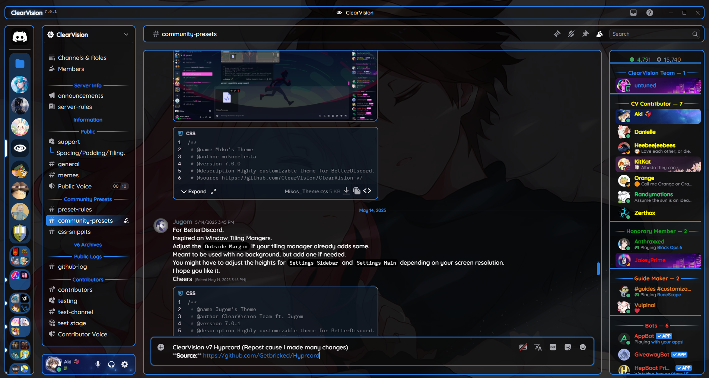
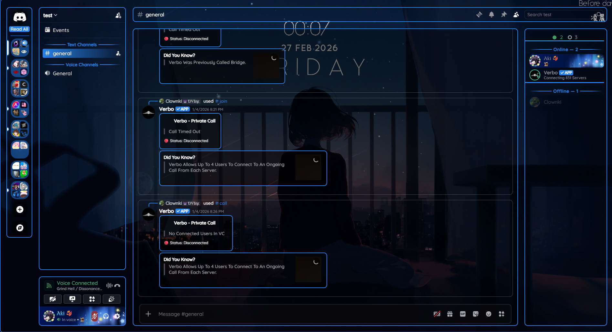

<div align="center">

# ClearVision Hyprcord - Customized by Aki

**Original Theme Repository**: [ClearVision v7](https://github.com/ClearVision/ClearVision-v7)

This theme is inspired by **Jugom** and the **Hyprland window manager**.

## Previews



</div>

## Installation

### 1. Download Your Preferred Version

#### **For Vencord:**

- **[Hyprcord Core](https://getbricked.github.io/Hyprcord/Hyprcord.css)** `Hyprcord.css`
  _(Core needs to be used along with your ClearVision v7)_

- **[Hyprcord Aki](https://getbricked.github.io/Hyprcord/Hyprcord-Aki.css)** `Hyprcord-Aki.css`
  _(Core + ClearVision Aki theme)_

#### **For BetterDiscord:**

- **[Hyprcord Core](https://getbricked.github.io/Hyprcord/Hyprcord.theme.css)** `Hyprcord.theme.css`
  _(Core needs to be used along with your ClearVision v7)_

- **[Hyprcord Aki](https://getbricked.github.io/Hyprcord/Hyprcord-Aki.theme.css)** `Hyprcord-Aki.theme.css`
  _(Core + ClearVision Aki theme)_

### 2. Place the Downloaded File in Your Themes Folder

### For advanced users:

Add the following line to your ClearVision theme file to import the theme:

```css
@import url("https://getbricked.github.io/Hyprcord/Hyprcord.css");
```

### For Online Theme Usage

```
https://getbricked.github.io/Hyprcord/Hyprcord.css
```

## Basic Customization

### 1. Change the Background Picture (Not for **Hyprcord Core**)

To set a custom background image, replace the URL inside `url()` with the link to your desired image:

```css
/* Custom Background Image */
:root {
  --background-image: url(https://i.imgur.com/zU7YY60.jpeg);
}
```

### 2. Change the Global Margin

```css
/* Global Margin */
:root {
  --global-margin: 20px; /* Default is 20px */
}
```

### 3. Change the Border

Above is default border style, you can customize it by changing the `--bordersize` and `--hsl-main-color` variables.

```css
:root {
  --border: var(--bordersize, 1px) solid var(--hsl-main-color);
  --bordersize: 1px;
}
```

## Special Edition
<div align="center">



</div>

**Online theme URL:** `https://getbricked.github.io/Hyprcord/Hyprcord-Aki-special.css`

**Features:**
- Compact design
- Old user panel (included old button style)
- Discord+ chat border
- Remove top bar (if you want to keep top bar can remove this line in the file:
``@import url('https://getbricked.github.io/Hyprcord/no-top-bar.css');``)
- Radial Status
- Transparent background 
- On hover animation and memberlist (can be turned off by removing this line in the file: ``@import url('https://getbricked.github.io/Hyprcord/utils.css');``)

**For further customization of the special edition:** (mostly ClearVision default options!)
```css
:root {
    /* ACCENT COLORS */
    --main-color: #2780e6; /* main accent color (hex, rgb or hsl) [default: #2780e6] */
    --hover-color: #1e63b3; /* hover accent color (hex, rgb or hsl) [default: #1e63b3] */
    --success-color: #43b581; /* positive accent color (hex, rgb or hsl) [default: #43b581] */
    --danger-color: #982929; /* danger accent color (hex, rgb or hsl) [default: #982929] */
    /* STATUS COLORS */
    --online-color: #43b581; /* online status color (hex, rgb or hsl) [default: #43b581] */
    --idle-color: #faa61a; /* idle status color (hex, rgb or hsl) [default: #faa61a] */
    --dnd-color: #982929; /* dnd status color (hex, rgb or hsl) [default: #982929] */
    --streaming-color: #593695; /* streaming status color (hex, rgb or hsl) [default: #593695] */
    --offline-color: #808080; /* offline/invisible status color (hex, rgb or hsl) [default: #808080] */
    /* APP BACKGROUND */
    --background-shading-percent: 100%; /* app background shading amount (0 for complete smoothness) [default: 100%] */
    --background-image: url(https://clearvision.github.io/images/sapphire.jpg); /* app background image (link must be HTTPS) [default: url(https://clearvision.github.io/images/sapphire.jpg)]*/
    --background-position: center; /* app background position [default: center] */
    --background-size: cover; /* app background size (px) [default: cover] */
    --background-attachment: fixed; /* app background attachment [default: fixed] */
    --background-filter: saturate(calc(var(--saturation-factor, 1) * 1)); /* app background adjustments (ex: blur, saturation, brightness) (more info: https://developer.mozilla.org/en-US/docs/Web/CSS/filter) [default: saturate(calc(var(--saturation-factor, 1) * 1))] */
    /* USER POPOUT BACKGROUND */
    --user-popout-image: var(--background-image); /* user popout background image (link must be HTTPS) (not applied to nitro users) [default: var(--background-image)] */
    --user-popout-position: var(--background-position); /* user popout position [default: var(--background-position)] */
    --user-popout-size: var(--background-size); /* user popout size (px) [default: var(--background-size)] */
    --user-popout-attachment: var(--background-attachment); /* user popout background attachment [default: var(--background-attachment)] */
    --user-popout-filter: var(--background-filter); /* user popout background adjustments (ex: blur, saturation, brightness) (more info: https://developer.mozilla.org/en-US/docs/Web/CSS/filter) [default: var(--background-filter);] */
    /* USER MODAL BACKGROUND */
    --user-modal-image: var(--background-image); /* user modal background image (link must be HTTPS) (not applied to nitro users) [default: var(--background-image)] */
    --user-modal-position: var(--background-position); /* user modal position [default: var(--background-position)] */
    --user-modal-size: var(--background-size); /* user modal size (px) [default: var(--background-size)] */
    --user-modal-attachment: var(--background-attachment); /* user modal background attachment [default: var(--background-attachment)] */
    --user-modal-filter: var(--background-filter); /* user modal background adjustments (ex: blur, saturation, brightness) (more info: https://developer.mozilla.org/en-US/docs/Web/CSS/filter) [default: var(--background-filter);] */
    /* HOME ICON */
    --home-icon: url(https://clearvision.github.io/icons/discord.svg); /* home button icon (link must be HTTPS) [default: url(https://clearvision.github.io/icons/discord.svg)]*/
    --home-size: cover; /* home button icon size (px) [default:cover] */
    /* FONTS */
    --main-font: "gg sans", "Helvetica Neue", Helvetica, Arial, sans-serif; /* main font for app (font must be installed) [default: gg sans, Helvetica Neue, Helvetica, Arial, sans-serif] */
    --code-font: Consolas, "gg mono", "Liberation Mono", Menlo, Courier, monospace; /* font for codeblocks (font must be installed) [default: Consolas, Liberation Mono, Menlo, Courier, monospace] */
    /* CHANNEL COLORS */
    --channel-normal: var(--interactive-text-default); /* channel text color [default: var(--interactive-text-default)] */
    --channel-muted: var(--interactive-muted); /* muted channel text color [default: var(--interactive-muted)] */
    --channel-hover: var(--interactive-text-hover); /* hovered channel text color [default: var(--interactive-text-hover)] */
    --channel-selected: var(--interactive-text-active); /* selected channel text color [default: var(--interactive-text-active)] */
    --channel-selected-bg: var(--main-color); /* selected channel background [default: var(--main-color)] */
    --channel-unread: var(--main-color); /* unread channel text color [default: var(--main-color)] */
    --channel-unread-hover: var(--hover-color); /* unread channel hover color [default: var(--hover-color)] */
    /* ACCESSIBILITY */
    --focus-color: var(--main-color); /* outline when pressing TAB key [default: var(--main-color)] */

    /* ---------------------- HYPRVISION CONFIG ---------------------- */
    /* ServerColumns addon */
    --columns: 1;
    --guildsize: 57;
    --aligndms: 0;

    /* Global margin for everything default is 20px */
    --global-margin: 20px;

    /* The size of border radius (default is 10px) */
    --global-radius: 10px;

    /* The size and style of border (default is 1px and var(--bordersize, 1px) solid var(--hsl-main-color) */
    --bordersize: 1px;
    --border: var(--bordersize, 1px) solid var(--hsl-main-color);
}

/* THEME SPECIFIC SHADING */
/* LIGHT THEME */
:is(.theme-light, .theme-dark .theme-light) {
  --background-shading: rgba(252, 252, 252, 0.3); /* app background shading color [default: rgba(252, 252, 252, 0.3)] */
  --card-shading: rgba(252, 252, 252, 0.3); /* cards background shading color [default: rgba(252, 252, 252, 0.3)] */
  --popout-shading: rgba(252, 252, 252, 0.7); /* popouts background shading color [default: rgba(252, 252, 252, 0.7)] */
  --modal-shading: rgba(252, 252, 252, 0.5); /* modals background shading color [default: rgba(0, 0, 0, 0.6)] */
  --input-shading: rgba(0, 0, 0, 0.3); /* inputs background shading color [default: rgba(0, 0, 0, 0.6)] */
  --normal-text: #36363c; /* text color [default: #36363c] */
  --muted-text: #75757e; /* muted text color [default: #75757e] */
}

/* ASH THEME */
:is(.theme-dark, .theme-light .theme-dark) {
  --background-shading: rgba(0, 0, 0, 0.4); /* app background shading color [default: rgba(0, 0, 0, 0.4)] */
  --card-shading: rgba(0, 0, 0, 0.2); /* cards background shading color [default: rgba(0, 0, 0, 0.2)] */
  --popout-shading: rgba(0, 0, 0, 0.6); /* popouts background shading color [default: rgba(0, 0, 0, 0.6)] */
  --modal-shading: rgba(0, 0, 0, 0.4); /* modals background shading color [default: rgba(0, 0, 0, 0.4)] */
  --input-shading: rgba(255, 255, 255, 0.05); /* inputs background shading color [default: rgba(255, 255, 255, 0.05)] */
  --normal-text: #d8d8db; /* text color [default: #d8d8db] */
  --muted-text: #aeaeb4; /* muted text color [default: #aeaeb4] */
}

/* DARK THEME */
:is(.theme-darker, .theme-light .theme-darker) {
  --background-shading: rgba(0, 0, 0, 0.6); /* app background shading color [default: rgba(0, 0, 0, 0.6)] */
  --card-shading: rgba(0, 0, 0, 0.3); /* cards background shading color [default: rgba(0, 0, 0, 0.3)] */
  --popout-shading: rgba(0, 0, 0, 0.7); /* popouts background shading color [default: rgba(0, 0, 0, 0.7)] */
  --modal-shading: rgba(0, 0, 0, 0.5); /* modals background shading color [default: rgba(0, 0, 0, 0.6)] */
  --input-shading: rgba(255, 255, 255, 0.05); /* inputs background shading color [default: rgba(255, 255, 255, 0.05)] */
  --normal-text: #fbfbfb; /* text color [default: #fbfbfb] */
  --muted-text: #94949c; /* muted text color [default: #94949c] */
}

/* ONYX THEME */
:is(.theme-midnight, .theme-light .theme-midnight) {
  --background-shading: rgba(0, 0, 0, 0.8); /* app background shading color [default: rgba(0, 0, 0, 0.8)] */
  --card-shading: rgba(0, 0, 0, 0.4); /* cards background shading color [default: rgba(0, 0, 0, 0.4)] */
  --popout-shading: rgba(0, 0, 0, 0.8); /* popouts background shading color [default: rgba(0, 0, 0, 0.8)] */
  --modal-shading: rgba(0, 0, 0, 0.6); /* modals background shading color [default: rgba(0, 0, 0, 0.6)] */
  --input-shading: rgba(255, 255, 255, 0.05); /* inputs background shading color [default: rgba(255, 255, 255, 0.05)] */
  --normal-text: #dcdcde; /* text color [default: #dcdcde] */
  --muted-text: #86868e; /* muted text color [default: #86868e] */
}
```

## Optional Utils

- **[No Top Bar](https://getbricked.github.io/Hyprcord/no-top-bar.css)** `no-top-bar.css`
- **[Discord+ Chat](https://getbricked.github.io/Hyprcord/discord+.css)** `discord+.css`

- **[Animation on Hover + Memberlist on Hover](https://getbricked.github.io/Hyprcord/utils.css)** `utils.css`

## Advanced Customization

For further customization, fork the repository and tailor it to your preferences.
